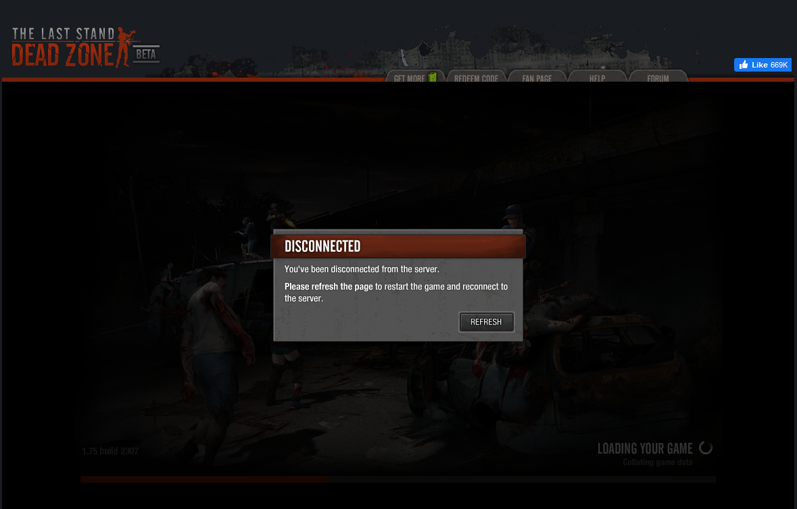

## TLSDZ Documentation

Effort to create The Last Stand: Dead Zone private server. Document everything we know about the game.

- [DeadZone-Private-Server on GitHub](https://github.com/SulivanM/DeadZone-Private-Server)
- [DeadZone-Documentation on GitHub](https://github.com/glennhenry/DeadZone-Documentation)

TLSDZ uses [PlayerIO backend service](https://playerio.com/). Our task is to design a server that response to the game request including making services that mimics PlayerIO backend.

## Our Progress

This is the furthest we have been (the latest change may have not been approved yet):

### What's Next?

You can help the development of the private server directly by making a change in the server code. You can also help us investigate, write helpful found, and let others develop the server.

Our general principle is:

1. Try to reach the point that our server is currently stuck at.
2. Investigate what is wrong and figure out what changes should be made to the server to progress further.
3. Document your findings or implement changes directly on the private server. Your finding may involve details about a specific piece of code, game packages or class, the game expected behavior without error, request or response specification, a known server issues, or possible solutions.
4. Repeat the process.

See [preloader](/preloader-main) and [core](/core-main) to know how the game works sequentially. Checkout the GitHub issues for the private server or ask questions away in our [Discord](https://discord.gg/Q5dTKrPmfq).

### Current Investigation

While the client-side game has all game resources, the server still send new resources overtime. There are few resources (like `config.xml`, `buildings.xml`, `resources_secondary.xml`) that must be sent every time.

The next step is the game loading player object, probably within the `onPlayerDataLoaded` function. One of the steps includes making a request to API 85, which is a player object request to BigDB. We are currently sending the default message, hence the game force us to refresh the game.

:::tip
Any error from the client should be sent to the server via [API 50](/glossary#api-50).
:::
