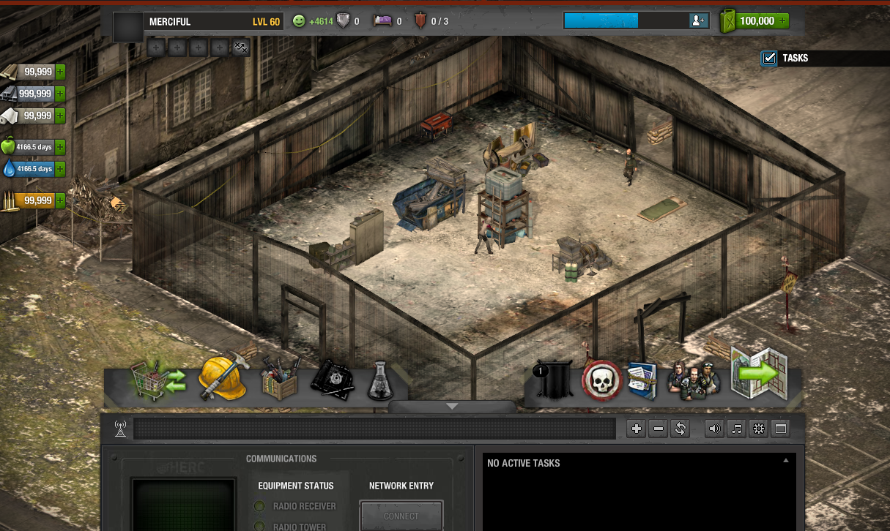

## TLSDZ Documentation

Effort to create The Last Stand: Dead Zone private server. Document everything we know about the game.

- [DeadZone-Private-Server on GitHub](https://github.com/SulivanM/DeadZone-Private-Server)
- [DeadZone-Documentation on GitHub](https://github.com/glennhenry/DeadZone-Documentation)

## Our Progress

TLSDZ uses [PlayerIO backend service](https://playerio.com/). Our task is to design a server that mimics it.

If you follow the development instruction correctly, you should be at this screen:

### What's Next?

You can help the development of the private server directly by making a change in the code. You can also help us investigate and let others develop the server.

Our general principle is:

1. Try to reach the point that our server is currently stuck at.
2. Investigate what is wrong and figure out what changes should be made to the server to progress further.
3. Write your research or make the changes directly.
4. Repeat the process.
