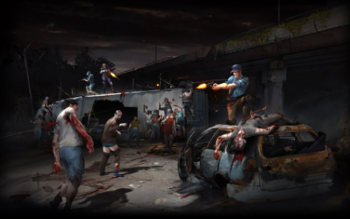

TLS:DZ uses [PlayerIO backend service](https://playerio.com/). Our task is to design a server that mimics it.

The game has `core.swf` and `preloader.swf`.

## Preloader

The preloader is what first loaded when we start the game. It does all the necessary preparation before loading the game, such as networking setup and authentication (e.g., AG, Kong, FB).

It is the “loading screen” of the game. It should show us this loading screen.

Then, the loading process begins. It will show the “Connecting to server“ and “Loading assets“ text. It downloads and extract packages such as `pak1.zip` and `pak2.zip`.

:::caution
The preloader won't show the loading screen if we haven't successfully authenticate.
:::

### Authentication

Our private server uses FB authentication. [`PlayerIOConnector`](/playerio/playerioconnector) class is the one that does the authentication job.

## Core

Core is the actual game which is loaded by the preloader.
